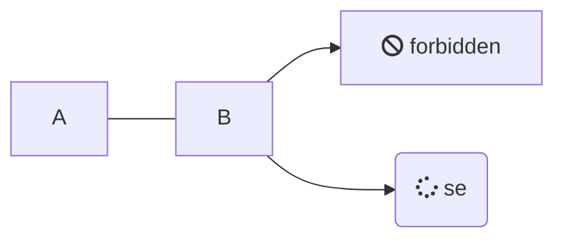

# Quick Start

Some example operator content here. :100:

$2^\Omega$

$\href{https://katex.org/}{\KaTeX}$

> [!TIP]
> This is helpful

> [!WARNING]
> This is helpful



```java
public class Test {
    public static void main(String[] test) {
        String foo = "bar";
    }
}

```

<small style="text-align: right; display: block"> Last updated: {docsify-updated} </small>