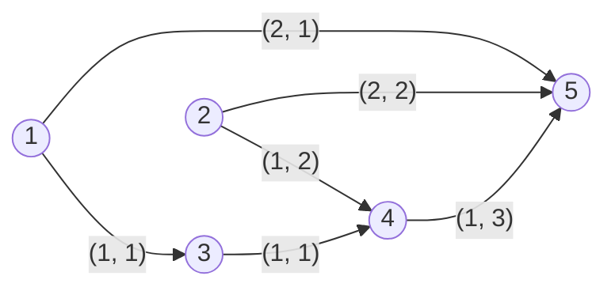

# FCAGE Vocabulary

The following RDF graph enumerates all classes and properties used in the vocabulary.

```Turtle
@prefix rdf: <http://www.w3.org/1999/02/22-rdf-syntax-ns#> .
@prefix rdfs: <http://www.w3.org/2000/01/rdf-schema#> .
@prefix xsd: <http://www.w3.org/2001/XMLSchema#> .
@prefix fcage: <https://w3id.org/fcage/> .

fcage:ExecutionNode a rdfs:Class .
fcage:ExecutionNodeWrapper a rdfs:Class .
fcage:ExecutionNodeInputDescription a rdfs:Class .
fcage:ExecutionNodeWrapperDescription a rdfs:Class .

fcage:hasInput a rdf:Property ;
               rdfs:domain fcage:ExecutionNode ;
               rdfs:range  fcage:ExecutionNodeInputDescription ;
.

fcage:fromNode a rdf:Property ;
               rdfs:domain fcage:ExecutionNodeInputDescription ;
               rdfs:range  fcage:ExecutionNode ;
.

fcage:fromPort a rdf:Property ;
               rdfs:domain fcage:ExecutionNodeInputDescription ;
               rdfs:range  xsd:integer ;
.

fcage:decoratedBy a rdf:Property ;
                  rdfs:domain fcage:ExecutionNode ;
                  rdfs:range  fcage:ExecutionNodeWrapperDescription ;
.

```

The classes `fcage:ExecutionNodeInputDescription` and `fcage:ExecutionNodeWrapperDescription` are implicit classes whose instances are expected to validate against the SHACL shapes as given in the following RDF graph.

```Turtle
@prefix rdf: <http://www.w3.org/1999/02/22-rdf-syntax-ns#> .
@prefix rdfs: <http://www.w3.org/2000/01/rdf-schema#> .
@prefix sh: <http://www.w3.org/ns/shacl#> .
@prefix xsd: <http://www.w3.org/2001/XMLSchema#> .
@prefix fcage: <https://w3id.org/fcage/> .

fcage:ExecutionNodeShape
  a sh:NodeShape ;
  sh:targetClass fcage:ExecutionNode ;
  sh:property fcage:ExecutionNode_hasInputShape ;
  sh:message "Invalid Input declaration! Please consult the documentation on how to declare Inputs." ;
.

fcage:ExecutionNode_hasInputShape
  a sh:PropertyShape ;
  sh:minCount 0;
  sh:maxCount 1;
  sh:path fcage:hasInput ;
  sh:node fcage:ExecutionNodeInputDescriptionShape ;
.

fcage:ExecutionNodeInputDescriptionShape
  a sh:NodeShape ;
  sh:xone (
            [ sh:class fcage:ExecutionNode ]
            [ sh:property fcage:InputDeclarationList ]
            [ sh:property fcage:InputDeclarationPortExplicitList ]
          ) ;
  sh:message "Invalid Input declaration! Please consult the documentation on how to declare Inputs." ;
.

fcage:InputDeclarationList
  a sh:PropertyShape ;
  sh:minCount 1 ;
  sh:path ( [ sh:zeroOrMorePath rdf:rest ] rdf:first ) ;
  sh:class fcage:ExecutionNode ;
.

fcage:InputDeclarationPortExplicitList
  a sh:PropertyShape ;
  sh:minCount 1 ;
  sh:path ( [ sh:zeroOrMorePath rdf:rest ] rdf:first ) ;
  sh:node [
    a sh:NodeShape ;
    sh:property [ sh:path fcage:fromPort ; sh:datatype xsd:integer ; sh:minCount 1 ; sh:maxCount 1 ] ;
    sh:property [ sh:path fcage:fromNode ; sh:class fcage:ExecutionNode ; sh:minCount 1 ; sh:maxCount 1 ] ;
  ] ;
.

fcage:decoratedBy_targetSubjectsShape
  a sh:NodeShape ;
  sh:targetSubjectsOf fcage:decoratedBy ;
  sh:class rdfs:Class ;
  sh:property [
    a sh:PropertyShape ;
    sh:minCount 1 ;
    sh:path ( [ sh:oneOrMorePath rdfs:subClassOf ] ) ;
    sh:class fcage:ExecutionNode ;
  ] ;
  sh:message "Invalid decoratedByShape declaration! Please consult the documentation on how to declare Inputs." ;
.

fcage:decoratedBy_targetObjectsShape
  a sh:NodeShape ;
  sh:xone (
    [ sh:class fcage:ExecutionNodeWrapper ]
    [ sh:property [ sh:path ( [ sh:zeroOrMorePath rdf:rest ] rdf:first ) ; sh:class fcage:ExecutionNodeWrapper ; sh:minCount 1 ] ]
  ) ;
  sh:message "Invalid decoratedByShape declaration! Please consult the documentation on how to declare Inputs." ;
.
```

An example for a valid configuration graph is given in the following RDF graph.

```Turtle
@prefix rdf: <http://www.w3.org/1999/02/22-rdf-syntax-ns#> .
@prefix rdfs: <http://www.w3.org/2000/01/rdf-schema#> .
@prefix xsd: <http://www.w3.org/2001/XMLSchema#> .
@prefix fcage: <https://w3id.org/fcage/> .
@prefix ex: <urn:example:valid-fcage-use-case> .

ex:MyExecutionNodeType rdfs:subClassOf fcage:ExecutionNode .

ex:node1 a ex:MyExecutionNodeType .

ex:node2 a ex:MyExecutionNodeType .

ex:node3 a ex:MyExecutionNodeType ;
         fcage:hasInput ex:node1 .

ex:node4 a ex:MyExecutionNodeType ;
         fcage:hasInput ( ex:node2 ex:node3 ) .

ex:node5 a ex:MyExecutionNodeType ;
         fcage:hasInput ( [ fcage:fromNode ex:node1 ; fcage:fromPort 2 ] 
                          [ fcage:fromNode ex:node2 ; fcage:fromPort 2 ]
                          [ fcage:fromNode ex:node 4 ; fcage:fromPort 1 ]
                        ) .
```

This results in the following graph layout.
> [!TIP]
> The edges are annotated with their corresponding (fromPort, toPort) tuples.


