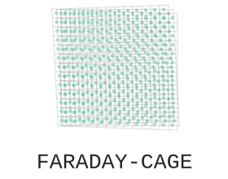

# Getting started

## About this Documentation {#about}

This documentation aims to be a comprehensive guide to FARADAY-CAGE.
It is subdivided into three parts:
 
1. Getting started
2. Writing configuration files
3. Extending FARADAY-CAGE

If you believe a part of it to be inaccurate or outdated, please
[file an issue](https://github.com/faraday-cage/deer/issues/new).

## What is FARADAY-CAGE? {#what}

**FARADAY-CAGE** is the **F**r**a**mework fo**r** **A**cyclic **D**irected Graphs **Y**ielding
Parallel **C**omput**a**tions of **G**reat **E**fficiency. It originated from the execution engine
of the redesigned [DEER](https://github.com/dice-group/deer) and has now been outsourced into a
project of its own to evaluate the possibility of also using it for other projects.

FARADAY-CAGE enable your projects to use a RDF configuration driven execution engine that can handle
any data flow that is shaped as a [DAG](https://en.wikipedia.org/wiki/Directed_acyclic_graph).
You just need to extend a couple of abstract classes to tailor-fit FARADAY-CAGE to your application
domain.